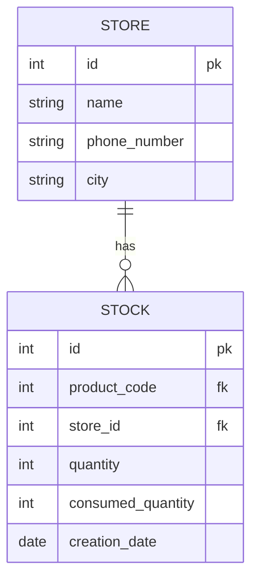
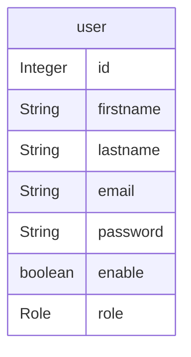
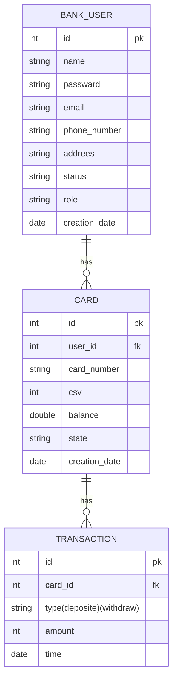

# Welcome to The Squad! 👋🏻

We are a group of passionate software engineers who are interested in building scalable and robust software systems.

Our mission is to simulate a microservices architecture e-commerce app.

## About the team

[@Abdelrahman Shaheen](https://github.com/AbdelrahmanShaheen)

[@Amr Al-Amassi](https://github.com/amro412)

[@Said Ahmed](https://github.com/said-ahmd)

[@Salma Ahmed](https://github.com/salmaahmed0)

[@Mustafa Moghazy](https://github.com/Mustafa-Moghazy)

Let's get started! and have a look at what we are trying to build! 🎉.

# E-Commerce Microservices Platform

we are simulating building an e-commerce platform using microservices architecture. We are building a platform that allows customers to browse products, add them to their cart, and purchase them. We are also building a platform that allows admins to manage products, categories, brands, stores, stocks and coupons.

## 1. Order Service
The Orders API microservice is an important component of our e-commerce platform, designed to efficiently handle the creation, management, and processing of our customers' orders. And it encapsulates order-related functionalities.

Check out the full details here 👉🏻 [Order Service API README file.](https://github.com/Fawry-Project/Order-Service-API)

and here is the ERD for the database used in this service:

## 2. Notification Service
The notification service is a Spring Boot application designed to handle notifications through email. It integrates with a Kafka topic to consume notification requests from an external source, processes these requests, and sends emails using JavaMailSender. Additionally, it features a retry mechanism to handle failed email delivery attempts, ensuring robustness and reliability in delivering notifications.

Check out the full details here 👉🏻 [Notification Service API README file.](https://github.com/Fawry-Project/notification-service-api)

and here is the ERD for the database used in this service:

## 3. Product Catalog API Service

This is a RESTful API designed for managing products, their categories, and consumption history. It provides endpoints for creating, retrieving, updating, and deleting products and categories, as well as recording product consumption history.

Check out the full details here 👉🏻 [Product Catalog API README file.](https://github.com/Fawry-Project/Product-API)

and here is the ERD for the database used in this service:

## 4. Coupons Service API
This RESTful API for managing coupons and their consumption history. It facilitates operations such as creating, retrieving, updating, and deleting coupons, as well as recording and managing coupon consumption.

Check out the [Coupons API README file.](https://github.com/Fawry-Project/Coupon-API)

and here is the ERD for the database used in this service:

## 5. Store Service
Store Service is a spring boot application designed for straightforward store inventory management. It comprises three main classes: Store, Stock, and ProductsConsumptions.

Check out the [Stores API README file.](https://github.com/Fawry-Project/store-service)

and here is the ERD for the database used in this service:

## 6.   Admin Management and Authentication Service
This service is an admin management and authentication service built using Spring Boot, Spring Security, and JSON Web Tokens (JWT). It provides a secure and efficient way to manage admin users, authenticate them using email and password, and generate JWTs for accessing protected resources. Additionally, admins have the ability to add other admins and activate or deactivate their accounts.

Check out the [Admin API README file.](https://github.com/Fawry-Project/Admin-Service)

and here is the ERD for the database used in this service:

## 7.   Bank Management Service
This is a Spring Boot application for a banking system that provides management for user accounts, transactions, and user information. The app is built using the Spring Boot framework and a MySQL database to store banking data.

Check out the [Bank API README file.](https://github.com/Fawry-Project/Bank-API)

and here is the ERD for the database used in this service:

---
